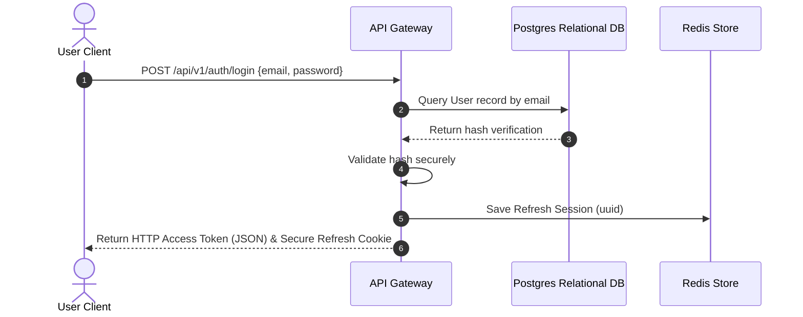
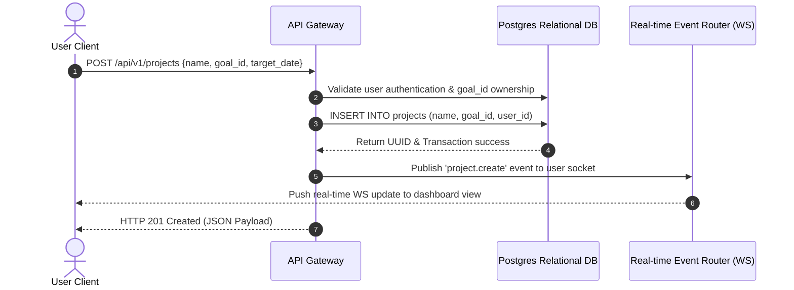
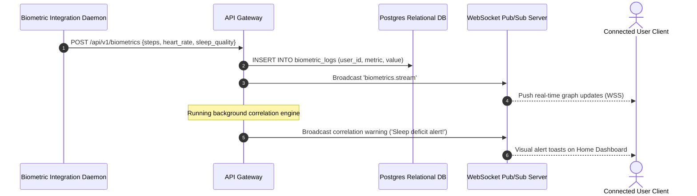
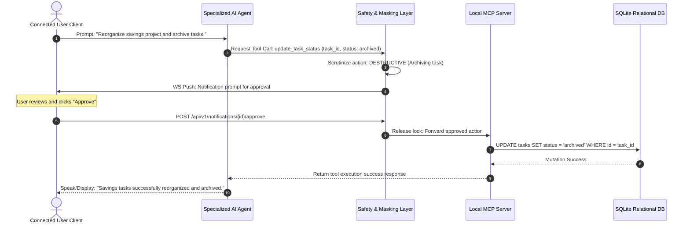

# Life OS API Architecture Specification

This document defines the complete **API Architecture** for **Life OS**. It outlines a multi-protocol interface (REST, WebSockets, Tauri IPC, and the Model Context Protocol), establishes strict security and gateway standards, specifies detailed REST endpoints across 11 functional domains, details WebSocket frame models, specifies internal and AI service APIs, produces sequence diagrams, and presents contract-first OpenAPI recommendations.

---

## 1. Multi-Protocol API Architecture

Life OS utilizes a **hybrid, multi-protocol communication engine** to satisfy transactional speed, real-time telemetry streaming, resource-efficient local operations, and standardized AI agent integrations.

```
                      +-----------------------------------+
                      |       Life OS Client Front-End     |
                      +-----------------------------------+
                        /                |                \
                       /                 |                 \
              (HTTPS) /            (WSS) |                  \ (Tauri IPC)
                     v                   v                   v
        +-------------------+   +------------------+   +-------------------+
        |     REST API      |   |   WebSocket API  |   |   Local Tauri     |
        |     Gateway       |   |   Pub/Sub Engine |   |   IPC Command     |
        +-------------------+   +------------------+   +-------------------+
                                         ^
                                         | (Model Context Protocol / JSON-RPC)
                                         v
                                +------------------+
                                |    AI Service    |
                                |     MCP Server   |
                                +------------------+
```

### Protocol Rationale
1. **REST Gateway (HTTPS)**: Default protocol for structured transactional CRUD operations, authentication, profile management, static resource delivery, data imports, and binary file-upload operations. REST provides reliable caching, predictable stateless session boundaries, and direct integration with standard network middleboxes.
2. **WebSocket Pub/Sub Engine (WSS)**: Delivers bidirectional, low-latency duplex communication. This channel is used to relay real-time background file-watcher synchronization changes, live biometric sensor data stream pushes, active agent conversation packets, and live toast notifications.
3. **Local Tauri IPC Channel**: Direct Rust-to-JS native channel utilized exclusively inside local desktop binaries. This channel bypasses network latency entirely, accesses local physical device APIs, monitors local directories, and queries the local SQLite DB directly.
4. **AI Service APIs (MCP / JSON-RPC)**: Implements the **Model Context Protocol (MCP)** standard over standard input/output (STDIO) or Server-Sent Events (SSE). It exposes structured tools, prompt templates, and local resource schemas directly to LLM orchestrators (such as Ollama or Cloud LLMs) using strict JSON-RPC 2.0 formatting.

---

## 2. Core Gateway & Security Standards

### Authentication & Authorization
- **Authentication**: Stateless session management utilizing **JSON Web Tokens (JWT)** combined with secure state rotation.
  - **Access Tokens**: Short-lived (15 minutes), passed inside the `Authorization: Bearer <JWT>` HTTP header.
  - **Refresh Tokens**: Long-lived (7 days), stored inside an HTTP-only, secure, SameSite=Strict cookie.
  - **Tauri Local Auth**: For local installations, refresh tokens are securely stored inside the system's local secure keychain (via Rust's `keyring` crate) and loaded during app bootstrap.
- **Authorization**: **Role-Based Access Control (RBAC)** coupled with **Resource-Level Ownership Validation**.
  - **Roles**: `user` (default), `admin` (system configuration), and `agent` (restricted API token scopes).
  - **Ownership Policy**: The API Gateway enforces that users can only view or mutate resources where `resource.user_id == authenticated_user.id`.
  - **Agent Scopes**: API keys issued to specialized AI agents support granular scopes (e.g., `scopes: ["tasks:read", "journals:write"]`).

### API Versioning
- **URL Path Versioning**: Mandatory prefix for all REST endpoints: `/api/v1/`.
- **Deprecation Policy**: Deprecated endpoints emit a standard HTTP header `Deprecation: true` along with `Sunset: YYYY-MM-DD`. Clients receive warnings inside response metadata envelopes.

### Error Handling
- **RFC 7807 Problem Details**: All API error responses adhere strictly to the `application/problem+json` format.
- **Response Structure**:
```json
{
  "type": "https://api.lifeos.org/errors/validation-failed",
  "title": "Validation Failed",
  "status": 422,
  "detail": "Due date cannot be in the past.",
  "instance": "/api/v1/tasks/task_90e3ab7d",
  "errors": [
    {
      "field": "due_date",
      "message": "Must be greater than or equal to 2026-07-27"
    }
  ]
}
```

### Pagination
- **Offset-Based Pagination**: Used for flat, static tables (e.g., listing projects or system logs).
  - **Parameters**: `limit` (default 20, max 100), `offset` (default 0).
  - **Response Envelope**:
    ```json
    {
      "data": [],
      "pagination": {
        "total_count": 145,
        "limit": 20,
        "offset": 40,
        "has_more": true
      }
    }
    ```
- **Cursor-Based Pagination**: Used for high-frequency logs and telemetry streams (e.g., biometric logs, financial transactions).
  - **Parameters**: `limit` (default 50), `starting_after` (UUID of the last record in the current page).
  - **Response Envelope**:
    ```json
    {
      "data": [],
      "pagination": {
        "limit": 50,
        "next_cursor": "c5c64b6e-d983-490c-bcae-fb56a81e9cb1",
        "has_more": true
      }
    }
    ```

### Filtering & Search
- **Advanced Filtering Syntax**: Filters are passed as URL query parameters with standardized column filters and logical operators:
  - `GET /api/v1/tasks?filter[status]=next&filter[priority]=high`
  - `GET /api/v1/transactions?filter[category]=groceries&filter[amount][lt]=50.00`
- **Search Mechanics**:
  - **Keyword Search**: Uses PostgreSQL Full-Text Search (FTS) with GIN indexing for direct term matches.
  - **Semantic Vector Search**: Uses Cosine Similarity searches via `pgvector` or local SQLite-vec over high-dimensional embeddings (e.g., 384 dimensions).
  - **Hybrid Search Ranking**: Matches are merged using **Reciprocal Rank Fusion (RRF)**:
    $$RRF\_Score = \frac{1}{60 + FTS\_Rank} + \frac{1}{60 + Vector\_Rank}$$

### Rate Limiting
- **Token Bucket Algorithm**: Implemented inside Redis at the Gateway level.
- **Authenticated Clients**: 1,200 requests per minute per authenticated User ID.
- **Unauthenticated Clients**: 30 requests per minute per IP Address (restricted to `/auth/` routes).
- **HTTP Response Headers**:
  - `X-RateLimit-Limit: 1200`
  - `X-RateLimit-Remaining: 1184`
  - `X-RateLimit-Reset: 1775839021`
- **Exhaustion Response**: Returns `429 Too Many Requests` with a Problem Details envelope.

### API Security
- **CORS Configuration**: Restricts access to trusted origins (e.g., `tauri://localhost`, `http://localhost:5173`).
- **Content Security Policy (CSP)**: Specifically designed for Tauri webviews:
  - `default-src 'self'; script-src 'self'; connect-src 'self' ws://localhost:8080 http://localhost:8080;`
- **Payload Limits**: File uploads are restricted to a maximum of 10MB. JSON payloads are strictly limited to 1MB.
- **Context Masking & Privacy Shield**: Before any user query is sent to external cloud LLM providers, a local `ContextMaskingService` replaces sensitive metrics (financial accounts, exact balances, private identification strings) with anonymous tokens. The mappings are stored inside transient Redis caches and reversed when responses return.
- **At-Rest Encryption**: Databases are encrypted locally using SQLCipher with AES-256 keys derived from the user's master passcode.

---

## 3. REST Endpoint Groups

### A. Core Personal Domains

#### 1. Users & Identity
- **POST `/api/v1/auth/register`**
  - **Description**: Registers a new user account.
  - **Headers**: `Content-Type: application/json`
  - **Request Body**:
    ```json
    {
      "email": "user@example.com",
      "password": "StrongPassword123!",
      "first_name": "Jane",
      "last_name": "Doe"
    }
    ```
  - **Responses**:
    - `201 Created`: Returns user object profile metadata.
    - `400 Bad Request` (Invalid payload format).
    - `409 Conflict` (Email already registered).

- **POST `/api/v1/auth/login`**
  - **Description**: Authenticates user; returns short-lived access token and sets long-lived secure refresh token cookie.
  - **Request Body**:
    ```json
    {
      "email": "user@example.com",
      "password": "StrongPassword123!"
    }
    ```
  - **Responses**:
    - `200 OK`: Sets cookie; returns:
      ```json
      {
        "access_token": "eyJhbGciOi...",
        "token_type": "Bearer",
        "expires_in": 900
      }
      ```
    - `401 Unauthorized` (Invalid credentials).

- **POST `/api/v1/auth/refresh`**
  - **Description**: Rotates access and refresh tokens. Reads HTTP-only refresh cookie.
  - **Responses**:
    - `200 OK`: Returns new access token; resets the HTTP-only cookie.
    - `401 Unauthorized` (Invalid or expired refresh token).

- **POST `/api/v1/auth/logout`**
  - **Description**: Invalidates the active refresh session in the Redis store and clears the client's cookie.
  - **Responses**:
    - `204 No Content`: Successful logout.

- **GET `/api/v1/users/me`**
  - **Description**: Retrieves active user profile.
  - **Headers**: `Authorization: Bearer <TOKEN>`
  - **Responses**:
    - `200 OK`: Returns User entity.
    - `401 Unauthorized`.

- **PATCH `/api/v1/users/me`**
  - **Description**: Updates user details and settings.
  - **Request Body**:
    ```json
    {
      "first_name": "Jane",
      "timezone": "Europe/London"
    }
    ```
  - **Responses**:
    - `200 OK`: Returns updated User entity.

---

#### 2. Goals
- **POST `/api/v1/goals`**
  - **Description**: Establishes a new long-term goal.
  - **Request Body**:
    ```json
    {
      "title": "Build Financial Security",
      "description": "Establish a stable liquid emergency fund.",
      "target_date": "2026-12-31",
      "metric_name": "Liquid Assets",
      "metric_target": 25000.00
    }
    ```
  - **Responses**:
    - `201 Created`: Returns the Goal entity (with generated UUID).
    - `422 Unprocessable Entity` (Target date in past).

- **GET `/api/v1/goals`**
  - **Description**: Retrieves paginated list of goals. Supports filtering by state (active, completed).
  - **Query Parameters**: `limit`, `offset`, `filter[status]`
  - **Responses**:
    - `200 OK`: Paginated envelope containing list of Goals.

- **GET `/api/v1/goals/{id}`**
  - **Description**: Retrieves details of a specific goal.
  - **Responses**:
    - `200 OK`: Goal entity.
    - `404 Not Found`.

- **PATCH `/api/v1/goals/{id}`**
  - **Description**: Updates goal parameters or current metric progression values.
  - **Request Body**:
    ```json
    {
      "metric_current": 5000.00
    }
    ```
  - **Responses**:
    - `200 OK`: Updated Goal entity.

- **DELETE `/api/v1/goals/{id}`**
  - **Description**: Hard or soft-deletes a goal.
  - **Responses**:
    - `204 No Content`: Successful deletion.

---

#### 3. Projects
- **POST `/api/v1/projects`**
  - **Description**: Deploys a new outcome-driven project.
  - **Request Body**:
    ```json
    {
      "goal_id": "40df3bb8-173d-49fc-9db6-fa41893de79d",
      "name": "Emergency Fund Accumulation",
      "description": "Save $2,000 monthly from primary salary income.",
      "status": "active",
      "target_date": "2026-12-31"
    }
    ```
  - **Responses**:
    - `201 Created`: Project entity.
    - `400 Bad Request` (Invalid Goal ID).

- **GET `/api/v1/projects`**
  - **Description**: Queries active, completed, or backlog projects.
  - **Query Parameters**: `limit`, `offset`, `filter[status]`, `filter[goal_id]`
  - **Responses**:
    - `200 OK`: Paginated envelope of projects.

- **GET `/api/v1/projects/{id}`**
  - **Description**: Retrieves details of a specific project, including its active task list.
  - **Responses**:
    - `200 OK`: Project entity alongside an array of nested active Tasks.

- **PATCH `/api/v1/projects/{id}`**
  - **Description**: Updates project status, description, or target dates.
  - **Request Body**:
    ```json
    {
      "status": "completed"
    }
    ```
  - **Responses**:
    - `200 OK`: Updated Project entity.

- **DELETE `/api/v1/projects/{id}`**
  - **Description**: Soft-deletes a project, archiving child tasks.
  - **Responses**:
    - `204 No Content`.

---

#### 4. Tasks
- **POST `/api/v1/tasks`**
  - **Description**: Creates an actionable task item.
  - **Request Body**:
    ```json
    {
      "project_id": "8b5e91ee-dfc1-409c-9df2-a9b0cc8129cc",
      "title": "Set up automated transfer to savings account",
      "priority": "high",
      "due_date": "2026-08-01",
      "recurrence_rule": "FREQ=MONTHLY;BYMONTHDAY=1"
    }
    ```
  - **Responses**:
    - `201 Created`: Task entity.

- **GET `/api/v1/tasks`**
  - **Description**: Queries user's tasks.
  - **Query Parameters**: `limit`, `offset`, `filter[status]`, `filter[priority]`, `filter[project_id]`
  - **Responses**:
    - `200 OK`: Paginated envelope of Tasks.

- **PATCH `/api/v1/tasks/{id}`**
  - **Description**: Modifies status, priority, or dates.
  - **Request Body**:
    ```json
    {
      "status": "completed",
      "completed_at": "2026-07-27T10:14:00Z"
    }
    ```
  - **Responses**:
    - `200 OK`: Updated Task entity.

- **DELETE `/api/v1/tasks/{id}`**
  - **Description**: Deletes a task.
  - **Responses**:
    - `204 No Content`.

---

#### 5. Memories (Journals)
- **POST `/api/v1/journals`**
  - **Description**: Commits a Daily, Weekly, Monthly, or Annual journal entry.
  - **Request Body**:
    ```json
    {
      "type": "daily",
      "base_date": "2026-07-27",
      "raw_markdown_path": "/vault/journals/daily/2026-07-27.md",
      "subjective_mood": 8,
      "sentiment_score": 0.75
    }
    ```
  - **Responses**:
    - `201 Created`: Journal entity.
    - `409 Conflict` (Journal for date already exists).

- **GET `/api/v1/journals`**
  - **Description**: Queries journal entries with cursor pagination.
  - **Query Parameters**: `limit`, `starting_after`, `filter[type]`, `filter[base_date]`
  - **Responses**:
    - `200 OK`: Cursor-paginated envelope of Journals.

- **GET `/api/v1/journals/{id}`**
  - **Description**: Retrieves details of a specific journal.
  - **Responses**:
    - `200 OK`: Journal details.

- **PATCH `/api/v1/journals/{id}`**
  - **Description**: Updates subjective scores or file references.
  - **Request Body**:
    ```json
    {
      "subjective_mood": 9
    }
    ```
  - **Responses**:
    - `200 OK`: Updated Journal entity.

---

#### 6. Knowledge (Documents & Notes)
- **POST `/api/v1/documents`**
  - **Description**: Registers a new evergreen note or uploads a file asset.
  - **Headers**: Multipart-Form (if uploading file) or JSON (if metadata/markdown register).
  - **Request Body**:
    ```json
    {
      "title": "Retirement Planning Strategies",
      "raw_markdown_path": "/vault/notes/retirement-planning.md"
    }
    ```
  - **Responses**:
    - `201 Created`: Document entity.

- **GET `/api/v1/documents`**
  - **Description**: Lists notes and files. Supports keyword/hybrid search.
  - **Query Parameters**: `limit`, `offset`, `search_query`, `search_mode` (keyword | vector | hybrid)
  - **Responses**:
    - `200 OK`: Paginated envelope of Documents, optionally ranked by hybrid score.

- **GET `/api/v1/documents/{id}`**
  - **Description**: Retrieves a document's full contents.
  - **Responses**:
    - `200 OK`: Document details with raw content or attachment download URL.

- **POST `/api/v1/documents/{id}/links`**
  - **Description**: Creates a backlink (graph edge) linking this note to another note.
  - **Request Body**:
    ```json
    {
      "target_note_id": "c1fcf895-d6d7-4b71-b0db-6e695fb42a0c",
      "relationship_type": "backlink"
    }
    ```
  - **Responses**:
    - `201 Created`: Returns the edge mapping.

---

### B. System & AI Agent Domains

#### 7. AI Agents
- **POST `/api/v1/agents`**
  - **Description**: Registers a specialized agent persona.
  - **Request Body**:
    ```json
    {
      "name": "FinanceCoach",
      "persona_role": "financial_advisor",
      "system_instructions": "You are a pragmatic, long-term wealth advisor. Prioritize emergency fund health before any speculative stocks."
    }
    ```
  - **Responses**:
    - `201 Created`: Agent details.

- **GET `/api/v1/agents`**
  - **Description**: Lists registered agents.
  - **Responses**:
    - `200 OK`: Array of AI Agents.

- **POST `/api/v1/agents/{id}/chat`**
  - **Description**: Dispatches a user query to a specialized agent. Run local context masking first.
  - **Request Body**:
    ```json
    {
      "message": "Review my savings project progress. Can I buy a car?",
      "stream": false
    }
    ```
  - **Responses**:
    - `200 OK`: Returns agent chat response chunk.
    - `403 Forbidden` (Agent does not have permission scopes for needed metrics).

- **PATCH `/api/v1/agents/{id}/instructions`**
  - **Description**: Modifies instructions or parameters for the agent.
  - **Request Body**:
    ```json
    {
      "system_instructions": "You are an aggressive high-growth financial advisor."
    }
    ```
  - **Responses**:
    - `200 OK`: Updated Agent entity.

---

#### 8. Reports
- **POST `/api/v1/reports`**
  - **Description**: Compiles a new telemetry report.
  - **Request Body**:
    ```json
    {
      "report_type": "health_correlation",
      "parameters": {
        "start_date": "2026-01-01",
        "end_date": "2026-06-30"
      }
    }
    ```
  - **Responses**:
    - `202 Accepted`: Emits compile job UUID inside response body for status polling.

- **GET `/api/v1/reports`**
  - **Description**: Queries past compiled reports.
  - **Query Parameters**: `limit`, `offset`
  - **Responses**:
    - `200 OK`: List of Reports.

- **GET `/api/v1/reports/{id}`**
  - **Description**: Returns compiled PDF download link or raw JSON statistical metrics.
  - **Responses**:
    - `200 OK`: Report metadata, statistical payloads, and object keys.

---

#### 9. Dashboards
- **GET `/api/v1/dashboard/metrics`**
  - **Description**: Aggregates high-level metrics for dashboard home panel.
  - **Headers**: `Authorization: Bearer <TOKEN>`
  - **Responses**:
    - `200 OK`:
      ```json
      {
        "tasks": {
          "outstanding_count": 8,
          "urgent_count": 1
        },
        "habits": {
          "active_streaks": [
            { "habit_name": "Meditation", "streak_days": 12 },
            { "habit_name": "Running", "streak_days": 4 }
          ]
        },
        "finances": {
          "savings_rate_pct": 32.4,
          "liquid_net_worth": 12450.00
        },
        "health": {
          "weekly_avg_sleep_minutes": 465,
          "avg_mood_rating": 7.4
        }
      }
      ```

---

#### 10. Notifications
- **GET `/api/v1/notifications`**
  - **Description**: Lists pending notifications.
  - **Query Parameters**: `limit`, `filter[is_read]`
  - **Responses**:
    - `200 OK`: List of notifications.

- **POST `/api/v1/notifications/{id}/approve`**
  - **Description**: Signs off on a pending critical agentic tool execution (Human-in-the-Loop workflow).
  - **Request Body**:
    ```json
    {
      "signed_confirmation": "USER_APPROVED_SIG_XXXXXX"
    }
    ```
  - **Responses**:
    - `200 OK`: Handled approval event; executes held task.
    - `410 Gone` (Hold expired or already handled).

- **PATCH `/api/v1/notifications/mark-read`**
  - **Description**: Sets `is_read = true` for notification lists.
  - **Request Body**:
    ```json
    {
      "notification_ids": ["c5c64b6e-d983-490c-bcae-fb56a81e9cb1"]
    }
    ```
  - **Responses**:
    - `204 No Content`.

---

#### 11. Administration
- **GET `/api/v1/admin/audit-logs`**
  - **Description**: Accesses system-wide audit records (Admin only).
  - **Query Parameters**: `limit`, `offset`, `filter[action_type]`
  - **Responses**:
    - `200 OK`: Paginated audit log records.
    - `403 Forbidden` (User does not possess 'admin' role).

- **POST `/api/v1/admin/backups`**
  - **Description**: Forces immediate compressed snapshot creation of relational SQLite/Postgres DB and Note Vault.
  - **Responses**:
    - `202 Accepted`: Emits compilation payload containing snapshot job metadata.

---

## 4. WebSocket API specification

To manage high-frequency data streaming and instant updates, the Core Gateway hosts a bidirectional **WebSocket (WSS) Pub/Sub Server**.

### Connection Lifecycle & Handshake
1. **Handshake Verification**: Client initiates WSS handshake. The client must pass the JWT access token as a query parameter or inside the protocol subheaders:
   `ws://localhost:8080/ws?token=eyJhbGciOi...`
2. **Authentication Check**: The Gateway validates the signature. If invalid, the socket drops immediately with close code `4003 (Unauthorized)`.
3. **Establish Connection**: On success, the connection is held.

### Heartbeat (Ping/Pong) Protocol
To prevent midway router timeouts and verify peer vitality, the client must ping every **30 seconds**.
- **Client Frame**: `{"event": "ping"}`
- **Server Response**: `{"event": "pong"}`
- **Failure Window**: If no message is received for 65 seconds, the server forcefully terminates the socket.

### WebSocket JSON Frame Schema
All messages traversing the WS channel must adhere strictly to the following envelope:
```json
{
  "event": "event_type",
  "topic": "namespace.resource.identifier",
  "payload": {},
  "timestamp": "2026-07-27T10:14:00Z"
}
```

### Core Events & Payloads

#### 1. `biometrics.stream`
- **Direction**: Server to Client
- **Topic**: `biometrics.live`
- **Description**: Relays high-frequency sensor readings (such as heart rate or steps) from peripheral integrations directly to dashboard visuals.
- **Payload**:
  ```json
  {
    "event": "biometrics.stream",
    "topic": "biometrics.live",
    "payload": {
      "heart_rate_bpm": 74,
      "systolic_bp": 120,
      "diastolic_bp": 80,
      "activity_status": "walking"
    },
    "timestamp": "2026-07-27T10:14:00Z"
  }
  ```

#### 2. `chat.message`
- **Direction**: Bidirectional
- **Topic**: `agents.chat.<agent_id>`
- **Description**: Facilitates sub-second conversational messaging with specialized agents.
- **Client Prompt Payload**:
  ```json
  {
    "event": "chat.message",
    "topic": "agents.chat.40df3bb8-173d-49fc-9db6-fa41893de79d",
    "payload": {
      "text": "Check health trends from yesterday."
    },
    "timestamp": "2026-07-27T10:14:00Z"
  }
  ```
- **Server Stream Chunk Response**:
  ```json
  {
    "event": "chat.message",
    "topic": "agents.chat.40df3bb8-173d-49fc-9db6-fa41893de79d",
    "payload": {
      "chunk_text": "Yesterday you slept for ",
      "is_final": false
    },
    "timestamp": "2026-07-27T10:14:01Z"
  }
  ```

#### 3. `file.sync`
- **Direction**: Bidirectional
- **Topic**: `vault.sync`
- **Description**: Synchronizes local file state modifications with the central server without reloading REST lists.
- **Payload**:
  ```json
  {
    "event": "file.sync",
    "topic": "vault.sync",
    "payload": {
      "action": "modify",
      "filepath": "/vault/journals/daily/2026-07-27.md",
      "sha256": "e3b0c44298fc1c149afbf4c8996fb92427ae41e4649b934ca495991b7852b855"
    },
    "timestamp": "2026-07-27T10:14:00Z"
  }
  ```

#### 4. `notifications.new`
- **Direction**: Server to Client
- **Topic**: `user.notifications`
- **Description**: Pushes critical telemetry triggers or human-in-the-loop task alerts directly to the user.
- **Payload**:
  ```json
  {
    "event": "notifications.new",
    "topic": "user.notifications",
    "payload": {
      "id": "c5c64b6e-d983-490c-bcae-fb56a81e9cb1",
      "title": "Approval Required",
      "message": "FinanceAgent requests tool access: 'write_ledger' for $25.00 transfer to Savings.",
      "requires_approval": true,
      "action_url": "/dashboard/notifications"
    },
    "timestamp": "2026-07-27T10:14:00Z"
  }
  ```

---

## 5. Internal APIs & Tauri IPC

In local-first desktop environments, client UI boundaries communicate with the underlying native OS through **Tauri IPC Command pathways** and a local asynchronous **Event Bus**.

```
+-----------------------------------+
|       React Front-End UI          |
+-----------------------------------+
        |                    ^
        | (Tauri Invoke)     | (Tauri Listen)
        v                    |
+-----------------------------------+
|      Tauri Rust Core Backend      |
+-----------------------------------+
        |                    ^
        | (Event Dispatch)   | (Event Listen)
        v                    |
+-----------------------------------+
|      Local Event Bus (MPSC)       |
+-----------------------------------+
```

### Tauri IPC Commands
The frontend calls the Rust backend using Tauri's typed command invocation model.
- **Command Name**: `invoke("command_name", { args })`
- **Interface Mappings**:
  - `invoke("get_local_vault_status")` -> Returns details on local Markdown directories and file counts.
  - `invoke("query_sqlite_graph", { query })` -> Direct IPC link to local relational database indexes.
  - `invoke("write_local_journal", { date, markdown })` -> Writes directly to local disk with strict transaction locks.

### Local Event Bus Namespaces
The Rust backend utilizes a high-performance Multi-Producer Single-Consumer (MPSC) async event bus to route domain events internally.
- **Namespaces**:
  - `lifeos::file_watcher::*`: Emitted on physical disk vault modifications.
  - `lifeos::biometrics::*`: Local hardware sensor aggregation feeds.
  - `lifeos::mcp_gateway::*`: Routes incoming Model Context Protocol requests.

---

## 6. AI Service APIs & Model Context Protocol (MCP)

To connect localized or remote LLMs securely to the user's private data, Life OS integrates an **embedded Model Context Protocol (MCP) Server**.

```
+------------------+                   +------------------+
|  AI Orchestrator |                   |   Life OS Core   |
|   (Client LLM)   |                   |    MCP Server    |
+------------------+                   +------------------+
        |                                       |
        | ------ listTools() -----------------> |
        | <----- [Tools List] ----------------- |
        |                                       |
        | ------ callTool(search_notes) ------> |
        |                                       | (Executes local
        |                                       |  search)
        | <----- [Search Result JSON] --------- |
```

### Protocol Standard
The MCP server communicates using **JSON-RPC 2.0** over STDIO or Server-Sent Events (SSE).

### Exposed Tool Specifications

#### 1. `search_notes`
- **Purpose**: Runs full-text and semantic vector search over notes.
- **Schema**:
  ```json
  {
    "name": "search_notes",
    "description": "Searches user notes using combined keyword and semantic hybrid vector queries.",
    "inputSchema": {
      "type": "object",
      "properties": {
        "query": { "type": "string", "description": "The search term or conceptual phrase." },
        "limit": { "type": "integer", "default": 5 }
      },
      "required": ["query"]
    }
  }
  ```

#### 2. `get_biometric_patterns`
- **Purpose**: Summarizes health trends (sleep/mood correlations) over a specified timeline.
- **Schema**:
  ```json
  {
    "name": "get_biometric_patterns",
    "description": "Retrieves statistical aggregates of user sleep quality, steps, and subjective mood ratings. Returns ratios instead of raw sensor streams for privacy protection.",
    "inputSchema": {
      "type": "object",
      "properties": {
        "days": { "type": "integer", "default": 7, "maximum": 30 }
      }
    }
  }
  ```

#### 3. `update_task_status`
- **Purpose**: Modifies a task's status (with HITL interception on destructive actions).
- **Schema**:
  ```json
  {
    "name": "update_task_status",
    "description": "Modifies the completion or archive state of a task. Archiving requires user validation.",
    "inputSchema": {
      "type": "object",
      "properties": {
        "task_id": { "type": "string", "format": "uuid" },
        "status": { "type": "string", "enum": ["inbox", "next", "scheduled", "completed", "archived"] }
      },
      "required": ["task_id", "status"]
    }
  }
  ```

#### 4. `draft_journal_entry`
- **Purpose**: Appends drafted reflection notes directly to local Markdown vault journals.
- **Schema**:
  ```json
  {
    "name": "draft_journal_entry",
    "description": "Drafts structured Markdown content and appends it safely to the specified Journal file.",
    "inputSchema": {
      "type": "object",
      "properties": {
        "date": { "type": "string", "format": "date" },
        "section_header": { "type": "string" },
        "markdown_content": { "type": "string" }
      },
      "required": ["date", "markdown_content"]
    }
  }
  ```

---

## 7. Architectural Sequence Diagrams

### Sequence A: User Authentication & Token Handshake
This diagram details standard JWT creation, session storage inside Redis, and cookie placement.



### Sequence B: Relational Goal & Project Creation
Demonstrates REST transaction flow leading to real-time sync announcements over WebSockets.



### Sequence C: Real-Time Biometric Streaming & Telemetry Alerts
This diagram outlines high-frequency biometric readings triggering automated background telemetry evaluations.



### Sequence D: AI Agent MCP Execution with Context Masking & HITL Approval
This diagram shows an agent utilizing a destructive tool, demonstrating how privacy masking and human sign-off are maintained.



---

## 8. OpenAPI 3.1 Structural Recommendations

Life OS contracts are designed following **contract-first OpenAPI schemas**. The core schema is structured as follows:

```yaml
openapi: 3.1.0
info:
  title: Life OS Core API Gateway
  version: 1.0.0
  description: Secure REST & WebSocket API Gateway for managing personal knowledge, goals, biometrics, and AI agent orchestration.
servers:
  - url: https://api.lifeos.org/api/v1
    description: Production Server Gateway
  - url: http://localhost:8080/api/v1
    description: Local Development Environment

paths:
  /auth/login:
    post:
      summary: User Login
      description: Validates login credentials, returns an access token, and places a secure HTTP-only refresh cookie.
      operationId: loginUser
      requestBody:
        required: true
        content:
          application/json:
            schema:
              $ref: '#/components/schemas/LoginRequest'
      responses:
        '200':
          description: Authentication successful.
          headers:
            Set-Cookie:
              schema:
                type: string
                description: HTTP-only session cookie for token rotation.
          content:
            application/json:
              schema:
                $ref: '#/components/schemas/LoginResponse'
        '401':
          $ref: '#/components/responses/UnauthorizedError'
        '422':
          $ref: '#/components/responses/ValidationError'

  /tasks:
    get:
      summary: List Tasks
      description: Retrieves a paginated list of tasks with filters.
      operationId: listTasks
      parameters:
        - name: limit
          in: query
          required: false
          schema:
            type: integer
            default: 20
        - name: offset
          in: query
          required: false
          schema:
            type: integer
            default: 0
        - name: filter[status]
          in: query
          required: false
          schema:
            type: string
            enum: [inbox, next, scheduled, completed, archived]
      responses:
        '200':
          description: List of tasks retrieved successfully.
          content:
            application/json:
              schema:
                type: object
                properties:
                  data:
                    type: array
                    items:
                      $ref: '#/components/schemas/Task'
                  pagination:
                    $ref: '#/components/schemas/PaginationMetadata'
        '401':
          $ref: '#/components/responses/UnauthorizedError'

    post:
      summary: Create Task
      description: Creates a new actionable task item.
      operationId: createTask
      requestBody:
        required: true
        content:
          application/json:
            schema:
              $ref: '#/components/schemas/TaskInput'
      responses:
        '201':
          description: Task created successfully.
          content:
            application/json:
              schema:
                $ref: '#/components/schemas/Task'
        '401':
          $ref: '#/components/responses/UnauthorizedError'
        '422':
          $ref: '#/components/responses/ValidationError'

components:
  securitySchemes:
    BearerAuth:
      type: http
      scheme: bearer
      bearerFormat: JWT

  schemas:
    LoginRequest:
      type: object
      required:
        - email
        - password
      properties:
        email:
          type: string
          format: email
          example: user@example.com
        password:
          type: string
          format: password
          example: StrongPassword123!

    LoginResponse:
      type: object
      properties:
        access_token:
          type: string
          example: eyJhbGciOiJIUzI1NiIsIn...
        token_type:
          type: string
          example: Bearer
        expires_in:
          type: integer
          example: 900

    TaskInput:
      type: object
      required:
        - title
      properties:
        project_id:
          type: string
          format: uuid
          example: 8b5e91ee-dfc1-409c-9df2-a9b0cc8129cc
        title:
          type: string
          example: Create emergency fund task
        priority:
          type: string
          enum: [low, medium, high, urgent]
          default: medium
        due_date:
          type: string
          format: date
          example: "2026-08-01"
        recurrence_rule:
          type: string
          example: "FREQ=MONTHLY;BYMONTHDAY=1"

    Task:
      type: object
      properties:
        id:
          type: string
          format: uuid
          example: a1b2c3d4-e5f6-7a8b-9c0d-1e2f3a4b5c6d
        user_id:
          type: string
          format: uuid
          example: f3a4b5c6-d4e5-6a7b-8c9d-0e1f2a3b4c5d
        project_id:
          type: string
          format: uuid
          nullable: true
          example: 8b5e91ee-dfc1-409c-9df2-a9b0cc8129cc
        title:
          type: string
          example: Create emergency fund task
        status:
          type: string
          enum: [inbox, next, scheduled, completed, archived]
          example: next
        priority:
          type: string
          enum: [low, medium, high, urgent]
          example: high
        due_date:
          type: string
          format: date
          nullable: true
          example: "2026-08-01"
        recurrence_rule:
          type: string
          nullable: true
          example: "FREQ=MONTHLY;BYMONTHDAY=1"
        completed_at:
          type: string
          format: date-time
          nullable: true
          example: "2026-07-27T10:14:00Z"
        created_at:
          type: string
          format: date-time
          example: "2026-07-27T10:14:00Z"
        updated_at:
          type: string
          format: date-time
          example: "2026-07-27T10:14:00Z"

    PaginationMetadata:
      type: object
      required:
        - total_count
        - limit
        - offset
        - has_more
      properties:
        total_count:
          type: integer
          example: 145
        limit:
          type: integer
          example: 20
        offset:
          type: integer
          example: 40
        has_more:
          type: boolean
          example: true

    ProblemDetails:
      type: object
      required:
        - type
        - title
        - status
        - detail
      properties:
        type:
          type: string
          format: uri
          example: https://api.lifeos.org/errors/validation-failed
        title:
          type: string
          example: Validation Failed
        status:
          type: integer
          example: 422
        detail:
          type: string
          example: Due date cannot be in the past.
        instance:
          type: string
          example: /api/v1/tasks/task_90e3ab7d
        errors:
          type: array
          items:
            type: object
            properties:
              field:
                type: string
                example: due_date
              message:
                type: string
                example: Must be greater than or equal to 2026-07-27

  responses:
    UnauthorizedError:
      description: Bearer token is missing, invalid, or expired.
      content:
        application/json:
          schema:
            $ref: '#/components/schemas/ProblemDetails'

    ValidationError:
      description: Provided fields did not pass constraints.
      content:
        application/json:
          schema:
            $ref: '#/components/schemas/ProblemDetails'
```
