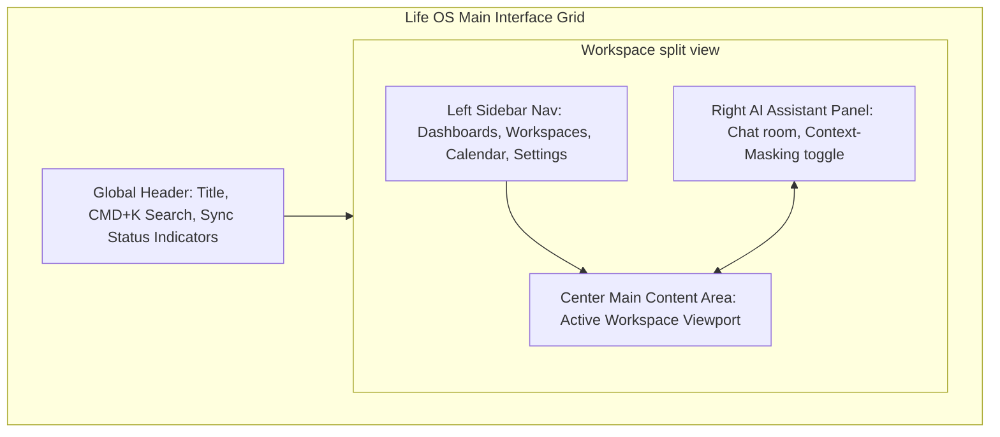
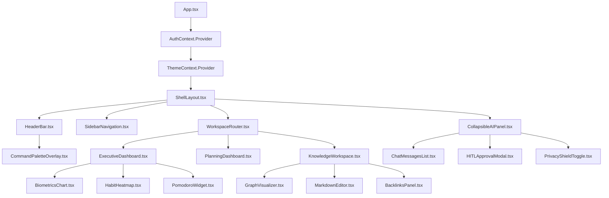

# Life OS Frontend Architecture Specification

This document specifies the complete **Frontend Architecture** for **Life OS**. It outlines a desktop-first, highly responsive React (TypeScript) SPA enclosed inside a native Tauri wrapper. It defines user interface components, layout systems, navigation flows, state management, routing, theme styling, accessibility compliance, and performance strategies, and includes high-fidelity wireframes and component diagrams.

---

## 1. Multi-Device Layout & Shell Architecture

Life OS utilizes a desktop-first, highly-integrated workspace shell styled with Tailwind CSS, utilizing a 3-column grid structure with a global floating Command Palette.

```
+---------------------------------------------------------------------------------------+
|  LOGO  | Search [CMD+K]                                    | Sync status (OK) | (A)  |
+--------+---------------------------------------------------+------------------+------+
| (B)    | (C) Main Content Area                             | (D) Collapsible  |      |
| Nav    |                                                   |     AI Assistant |      |
| Item 1 |                                                   |     Panel        |      |
| Nav    |                                                   |                  |      |
| Item 2 |                                                   |                  |      |
| Nav    |                                                   |                  |      |
| Item 3 |                                                   |                  |      |
|        |                                                   |                  |      |
+--------+---------------------------------------------------+------------------+------+
| Settings (F)                                               | Trigger/Prompt   | (E)  |
+---------------------------------------------------------------------------------------+
```

### Layout Grid Rationale
- **(A) Header Bar**: Static, lightweight. Houses the global search trigger, system sync indicators, and status indicators (online, database locks, local vault status).
- **(B) Main Navigation Sidebar**: Collapsible, responsive sidebar. Employs icons and descriptive text for swift page transitions. Resides as a permanent fixture on wider viewports (> 1024px) and collapses into a slide-out drawer on tablet/mobile views.
- **(C) Main Content Area**: Flexible grid container. Auto-scrolls and implements vertical virtualized viewport layers for heavy datasets.
- **(D) Collapsible AI Assistant Panel**: Persistent right-aligned drawer (360px default). Houses active conversational context with the specialized Cabinet of Agents. Can be collapsed with `[CMD+I]` or slide triggers.
- **(E) Command Palette overlay**: Triggered globally via `[CMD+K]`, overlaying a backdrop-blur mask. Serves as a keyboard-centric Quick Capture terminal.

### Screen Layout Wireframe (Mermaid)
The following visual wireframe represents the structural layout grid of the Life OS app shell:



---

## 2. Main Workspaces & Interface Designs

The React application is structured into eight focused workspace routes, each consuming specialized endpoint APIs or Tauri IPC Rust channels.

### 1. Executive Dashboard
The executive interface displays real-time telemetry metrics, outstanding task lists, and focus widgets to optimize operational performance.
- **Biometric Health Widgets**: Visualized using SVG-based Canvas charts (Chart.js or Recharts). Renders a week-over-week summary of average sleep duration, sleep quality ratios, resting heart rates, and daily step counts.
- **Habit Streaks Tracker**: A 12-month calendar heatmap (similar to GitHub's contribution matrix) displaying completed habit logs, with dynamic tooltip hovers showing cues, targets, and streaks.
- **Focus Timer Widget**: A Pomodoro tracking widget with integrated custom timers. Implements custom native hooks utilizing Tauri’s idle-timer inhibitors, preventing the host machine from sleeping during active sessions.
- **Active Financial Ledger**: Visual representation of account totals, monthly income, monthly expenses, savings rate percentage, and recent transactions.

### 2. Planning Dashboard
Translates the Strategic Layer's goals into day-to-day actionable task cards.
- **Goal Timelines**: Linear gantt-style lists displaying multi-month milestones with progress bars representing the percentage of linked active projects that have been completed.
- **Project Boards**: A Scrum-inspired Kanban board. Projects are grouped in lanes: `Backlog`, `Active`, `Paused`, and `Completed`. Supports HTML5 drag-and-drop actions.
- **Active Task List & Backlog**: Multi-column data grid with instant status toggle checkboxes, priority badges (`Low`, `Medium`, `High`, `Urgent`), due date flags, and recurrence symbols.

### 3. Knowledge Workspace (The "Second Brain")
A dual-pane knowledge base that allows users to write notes and visualize connections in their personal knowledge graph.
- **Personal Knowledge Graph Graph (Interactive)**: Utilizes a high-performance WebGL force-directed layout engine (e.g., `react-force-graph` or custom D3 selection wrappers). Notes represent nodes, and backlinks represent directional edges. Clicking a node redirects the main pane to that document.
- **Rich Markdown Editor**: A dual-state (WYSIWYG / Raw MD splits) text area. Employs parsing plugins for live backlink compilation (`[[Note Title]]`), syntax highlighting, and frontmatter YAML metadata modification.
- **Backlinks Panel**: A bottom-aligned collapsible tray listing all incoming documents that reference the active note.

### 4. Research Workspace
An inbox for captured external resources, links, and documents.
- **Web Clipper Inbox**: Renders clipped content (HTML-to-Markdown conversions) from browser extensions.
- **RSS & Bookmark Feed**: Unified card deck representing external bookmarks, parsed articles, and RSS updates. Supports tagging and one-click conversion of an article card into a permanent Knowledge Note.

### 5. Calendar Interface
The scheduling and timeline hub of Life OS.
- **Calendar Views**: Full calendar matrix offering Day, Week, Month, and Agenda timelines.
- **Time-Block Planner**: Left side lists due tasks, right side lists the hourly calendar. Users can drag a task card directly into an empty hour slot to automatically create a scheduled `calendar_event` transaction.
- **CalDAV Sync Overlay**: Configures remote overlays (e.g., Google Calendar, Apple Calendar) alongside local private calendars.

### 6. Reports Workspace
Deep-analytical data compiling suite.
- **Telemetry Charts**: Interactive multi-variable line charts plotting historical correlations (e.g., "Mood rating vs. Sleep duration" or "Total monthly spending vs. Average meditation streak").
- **PDF/JSON Export Tool**: Direct interface allowing the user to select domains, configure date limits, and download structured telemetry reports.

### 7. Settings Interface
System configurations and local security keys.
- **File System Vault Paths**: File selector interfacing with Tauri's native `dialog::open` API to mount local Markdown directories.
- **Database Backup Scheduler**: Sync parameters, cron timetables, and backup actions.
- **AI Credentials & Local Routing**: Toggle between **Local Ollama** (specifying model strings like `llama3`, `mistral`) and **Cloud LLM Gateways** (OpenAI, Anthropic) with custom API key inputs. Key inputs are saved directly to the system's local secure keychain via Tauri IPC.

### 8. AI Assistant Interface
The direct workspace panel for personal human-AI collaboration.
- **Chat Room**: A standard messaging UI designed for real-time streaming tokens. Displays markdown, code blocks, bulleted tables, and mathematical formulas.
- **Persona Selector**: Tab selectors or dropdown selectors to switch between active agent personas (e.g., Finance Coach, Sleep Analyst, Master Life Coach).
- **Context-Masking Privacy Shield Dashboard**: A visual ledger showing what sensitive data has been intercepted, scrubbed, and anonymized before external transmission. Includes toggles for category sensitivity (e.g., "Hide financial numbers", "Anonymize medical terminology").
- **Human-in-the-Loop Interception Panel**: When an agent attempts an active/destructive tool action (e.g., writing a financial ledger record or archiving a calendar appointment), a modal card intercepts the screen. It prompts the user for explicit approval with options to: `Approve Action`, `Reject Action`, or `Modify Parameters`.

---

## 3. UI Component Hierarchy & Architecture

Life OS divides frontend components into a highly modular, decoupled hierarchical tree to prevent redundant rendering cycles and isolate domain-specific UI changes.

```
+-----------------------------------------------------------------------+
| App Component                                                         |
|  +-----------------------------------------------------------------+  |
|  | Shell Layout (Global Provider Context, Toast, CmdPalette)       |  |
|  |  +-------------------------------------+ +--------------------+  |  |
|  |  | Sidebar Navigation                  | | Header Bar         |  |  |
|  |  +-------------------------------------+ +--------------------+  |  |
|  |  +------------------------------------------------------------+  |  |
|  |  | Workspace Viewport Router (Active Route Component)          |  |  |
|  |  |  +------------------------+ +----------------------------+  |  |  |
|  |  |  | KnowledgeWorkspace    | | ExecutiveDashboard         |  |  |  |
|  |  |  |  +------------------+  | |  +----------------------+  |  |  |  |
|  |  |  |  | GraphVisualizer  |  | |  | BiometricsChart      |  |  |  |  |
|  |  |  |  +------------------+  | |  +----------------------+  |  |  |  |
|  |  |  |  +------------------+  | |  +----------------------+  |  |  |  |
|  |  |  |  | MarkdownEditor   |  | |  | HabitHeatmap         |  |  |  |  |
|  |  |  |  +------------------+  | |  +----------------------+  |  |  |  |
|  |  |  +------------------------+ +----------------------------+  |  |  |
|  |  +------------------------------------------------------------+  |  |
|  |  +------------------------------------------------------------+  |  |
|  |  | Collapsible AI Panel                                       |  |  |
|  |  |  +-------------------+ +---------------------------------+  |  |  |
|  |  |  | ChatMessagesList  | | HITLApprovalModal               |  |  |  |
|  |  |  +-------------------+ +---------------------------------+  |  |  |
|  |  +------------------------------------------------------------+  |  |
|  +-----------------------------------------------------------------+  |
+-----------------------------------------------------------------------+
```

### Component Architecture Diagram (Mermaid)
The following React component composition structure illustrates state dependencies and unidirectional data flows:



---

## 4. Frontend State Management & Routing Architecture

### Frontend State Segregation
To ensure rapid re-renders and clean separation of concerns, Life OS segregates client state into three distinct layers:

| State Layer | Framework / Technology | Scope & Responsibilities | Synchronization Interval |
| :--- | :--- | :--- | :--- |
| **Global Client State** | **Zustand** | App UI configurations, collapsible panel toggles, theme properties, current user session status, Command Palette visibility. | Ephemeral (In-memory, reset on reload). |
| **Relational Data Cache** | **TanStack Query (React Query)** | Caches database responses from PostgreSQL/SQLite for tasks, goals, habits, biometric history, and transaction lists. | Dynamic (revalidated on mutation, focus shifts, or WS sync pings). |
| **Local Component State** | **React Hooks (`useState`, `useReducer`)** | Transient forms, focused inputs, rich text editor draft strings, local search queries. | Bound directly to component lifespan. |

#### Zustand Global UI Store Design (TypeScript Spec)
```typescript
interface UIState {
  sidebarOpen: boolean;
  aiPanelOpen: boolean;
  activeAgentId: string | null;
  commandPaletteOpen: boolean;
  activeTheme: 'light' | 'dark' | 'high-contrast';
  setSidebarOpen: (open: boolean) => void;
  setAIPanelOpen: (open: boolean) => void;
  setActiveAgentId: (id: string | null) => void;
  toggleCommandPalette: () => void;
  setTheme: (theme: 'light' | 'dark' | 'high-contrast') => void;
}
```

#### TanStack Query Sync Lifecycle
1. **Query Fetching**: The component mounts and triggers `useQuery(['tasks', filterParams])`. The hook verifies if a fresh, non-stale copy exists inside the TanStack Query Cache. If yes, it returns the cache immediately.
2. **Background Fetching**: React Query queries the API Gateway REST endpoint (or invokes Tauri's direct SQLite reader command).
3. **Invalidation**: On user mutations (e.g., executing `useMutation(updateTaskStatus)`), the client sends the update. Upon receiving a success payload, React Query triggers `queryClient.invalidateQueries(['tasks'])`.
4. **WebSocket Sync Hooks**: The application mounts a global WebSocket listener hook. When a `file.sync` or `notifications.new` event frame is pushed from the server (e.g., background Rust file-watchers updating SQLite tasks from markdown files), the hook triggers `queryClient.invalidateQueries` for the modified domain, instantly updating the React dashboard without full-screen reloads.

### Frontend Client Routing Architecture
- **Router Technology**: **React Router v6** utilizing **`HashRouter`** boundaries.
- **Rationale**: Standard browser `BrowserRouter` utilizes path-based routing (e.g., `/dashboard/settings`). Inside Tauri desktop wrappers or Electron applications, local source assets are served directly from local file indexes (`file://` or `tauri://localhost/index.html`). Path-based routers will fail on refresh because the asset engine cannot find a file at `tauri://localhost/dashboard/settings`. A `HashRouter` uses hash anchors (e.g., `tauri://localhost/index.html#/dashboard/settings`), guaranteeing correct index resolution across all platforms.
- **Private Route Protection**: Implements a layout-level guard (`<ProtectedRoute>`). If the active session token is missing from Zustand state, the router automatically intercepts navigation and redirects to the `#/auth/login` page.

---

## 5. Themes, Responsiveness, & Accessibility Standards

### Theme Architecture & Tailwind Setup
Styling is configured using Tailwind utility classes coupled with standard CSS custom properties (variables) defined inside `src/index.css`. This prevents the bundle from duplicate compiles and allows quick programmatic overrides.

```css
/* Styling Specification inside src/index.css */
:root {
  --background: #ffffff;
  --foreground: #1e293b;
  --primary: #3b82f6;
  --primary-hover: #2563eb;
  --accent: #f1f5f9;
  --border: #e2e8f0;
}

.dark {
  --background: #0f172a;
  --foreground: #f8fafc;
  --primary: #60a5fa;
  --primary-hover: #3b82f6;
  --accent: #1e293b;
  --border: #334155;
}

.high-contrast {
  --background: #000000;
  --foreground: #ffffff;
  --primary: #ffff00; /* High visible yellow */
  --primary-hover: #ffcc00;
  --accent: #111111;
  --border: #ffffff; /* Explicit white borders */
}
```
*How it works*: Tailwind is configured with standard overrides: `theme: { extend: { colors: { background: 'var(--background)' } } }`. Changing the theme simply requires appending or removing the active class (`.dark`, `.high-contrast`) from the main HTML document body.

### Accessibility Requirements (WCAG 2.1 AA Compliance)
Because Life OS is designed to be the definitive life-management engine for all users over decades, the interface enforces strict accessibility standards:
1. **Interactive Element Contrast**: Text-to-background contrast ratios must conform strictly to WCAG 2.1 AA minimum parameters (at least 4.5:1 for standard text, 3:1 for large headings). The `high-contrast` mode guarantees contrast ratios $> 7:1$.
2. **Keyboard Traps & Focus Management**:
   - Every input block, tab selector, and button must exhibit a highly-visible focus ring wrapper (`focus-visible:ring-2 focus-visible:ring-primary`).
   - Modal boundaries (like the `Command Palette` or `HITL modal`) implement strict **focus traps** (using libraries like `focus-trap-react`). Tab keys are locked inside the active viewport modal until it is dismissed.
3. **Screen Reader Integration**: All components utilize descriptive HTML5 semantic tags (`<nav>`, `<header>`, `<main>`, `<article>`, `<aside>`) coupled with explicit `aria-label` attributes for custom dashboards (e.g., `<button aria-label="Toggle AI Assistant Panel">`).

### Responsive Layout Strategy
To accommodate native desktop layouts, local tablet views, and native mobile packaging overlays:
- **Tailwind Grid Breakpoints**: Layout boundaries scale programmatically across standard Tailwind screen thresholds:
  - `sm` ($640px$): Single-column cards, collapsible header overlays.
  - `md` ($768px$): Dual-column split card grids.
  - `lg` ($1024px$): Sidebar Nav locks into place, main dashboard switches to 3-column structures.
  - `xl` ($1280px$): AI panel defaults to open, knowledge graph displays full network maps.
- **Capacitor Mobile Packaging Compatibility**: The styling eliminates static platform assumptions. Touch elements utilize cursor-pointer variables, and inputs automatically trigger viewport height resizing adjustments to prevent OS mobile keyboard overlapping.

---

## 6. Performance Optimization Strategy

Life OS executes entirely on local client hardware. Consequently, the frontend must preserve CPU cycles and maintain a strict memory footprint:

1. **Virtualized Scrollers for Massive Timeline Feeds**:
   - When listing years of financial transactions, daily biometric streams, or audit log tables, standard DOM rendering causes severe browser lag.
   - We mandate the use of **Windowed Rendering** (via `react-window` or `react-virtualized`). Only the visible elements (plus a small offset buffer) are active in the DOM, keeping memory footprint constant regardless of list size.
2. **WebGL Knowledge Graph Rendering**:
   - The force-directed graph node engine uses WebGL Canvas rendering instead of SVG. This allows the Personal Knowledge Graph to render $> 5000$ connected note nodes smoothly at 60 FPS.
3. **Vite Bundle Splitting & Dynamic Lazy Loading**:
   - Primary route bundles are split cleanly using React’s native dynamic imports (`React.lazy`).
   - The workspace views (e.g., the complex knowledge graph engine or the report analytics engine) are loaded asynchronously on-demand:
     ```typescript
     const KnowledgeWorkspace = React.lazy(() => import('./workspaces/KnowledgeWorkspace'));
     ```
4. **Input Debouncing**:
   - Real-time search filters and graph query inputs are debounced by `200ms` to prevent redundant relational database query sweeps on every keystroke.

---

## 7. Personal Knowledge Graph Visualization Component (Wireframe)

This diagram outlines how the Knowledge Graph workspace arranges node visualization, note navigation, and metadata parsing inside the client view.

```
+---------------------------------------------------------------------------------------+
|  KNOWLEDGE WORKSPACE                                               | Focus: [Note A] |
+--------------------------------------------------------------------+------------------+
| (A) Node Graph Visualization Canvas (WebGL)                        | (B) Backlinks    |
|                                                                    |     Panel        |
|               (Note B)                                             | - Note B -> A    |
|                  |                                                 | - Note C -> A    |
|                  v                                                 |                  |
|               [Note A] <----- (Note C)                             |                  |
|                  |                                                 |                  |
|                  v                                                 |                  |
|               (Note D)                                             |                  |
|                                                                    |                  |
+--------------------------------------------------------------------+------------------+
| (C) Raw Editor / Preview Splits                                    | (D) Frontmatter  |
|                                                                    |     YAML Panel   |
| # Note A                                                           | tags: [finance]  |
| This is a core note referencing [[Note D]]...                     | created: 2026-07 |
|                                                                    |                  |
+---------------------------------------------------------------------------------------+
```

---

## 8. Frontend Contract-First API Integration Schemas

Components communicate with the API Gateway or Tauri local channels using strict JSON request/response structures.

### 1. Unified Dashboard Payload Schema
Components rendering the Executive Dashboard consume the following structured state layout payload:
```json
{
  "last_updated": "2026-07-27T10:14:00Z",
  "biometrics_summary": {
    "weekly_average_sleep_quality_pct": 82,
    "resting_heart_rate_avg": 64,
    "step_count_daily_average": 9420
  },
  "habits_grid": [
    {
      "habit_id": "40df3bb8-173d-49fc-9db6-fa41893de79d",
      "habit_name": "Running",
      "streak_days": 12,
      "matrix_completion": [
        { "date": "2026-07-26", "value": 1.00 },
        { "date": "2026-07-27", "value": 0.00 }
      ]
    }
  ],
  "recent_financial_balances": {
    "total_liquid_assets": 12450.00,
    "monthly_savings_rate_pct": 32.4
  }
}
```

### 2. Human-in-the-Loop Interception Dialog Schema
The `HITLApprovalModal` component is triggered on-screen when receiving the following WebSocket frame message:
```json
{
  "event": "notifications.new",
  "topic": "user.notifications",
  "payload": {
    "id": "c5c64b6e-d983-490c-bcae-fb56a81e9cb1",
    "requires_approval": true,
    "interception_type": "destructive_tool_call",
    "details": {
      "requesting_agent": "FinanceCoachAgent",
      "tool_name": "delete_note",
      "parameters": {
        "filepath": "/vault/notes/duplicate-retirement-planning.md"
      }
    }
  },
  "timestamp": "2026-07-27T10:14:00Z"
}
```
*Action*: The user responds by issuing a POST transaction to `/api/v1/notifications/{id}/approve` containing:
```json
{
  "signed_confirmation": "USER_APPROVED_SIG_c5c64b6e"
}
```
This releases the MPSC thread lock on the Core local engine, allowing the agent to proceed.
